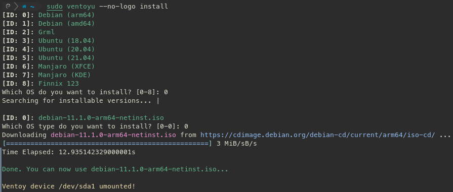

# Ventoy Updater

<pre>
  _    __           __              __  __
 | |  / /__  ____  / /_____  __  __/ / / /
 | | / / _ \/ __ \/ __/ __ \/ / / / / / / 
 | |/ /  __/ / / / /_/ /_/ / /_/ / /_/ /  
 |___/\___/_/ /_/\__/\____/\__, /\____/   
                          /____/          
</pre>


Ventoy is a tool that allows you to create a bootable USB drive for multiple ISO files.
Just copy your ISO files onto the drive and boot it.

__ventoyu__ is a utility that can be used to install or even update ISO files on the USB drive.
Besides ventoyu also contains features like set up a new USB drive with the Ventoy software, manage ISO sources or modify Ventoy attributes on your USB drive. 

ventoyu contains a configuration file (JSON format) with all sources where ISO files can be downloaded.

The __ventoyl__ class can help you to talk to your Ventoy device using Python. More information here: [Wiki: ventoyLIB](https://github.com/mawigh/ventoyu/wiki/ventoyLIB)

---

You will find more information about the Ventoy software here:

Official Ventoy Website:
https://www.ventoy.net/en/index.html

Ventoy on GitHub:
https://github.com/ventoy/Ventoy

# Table of Contents
- [Ventoy Updater](#ventoy-updater)
- [Table of Contents](#table-of-contents)
  - [Description](#description)
  - [OS Support](#os-support)
  - [Install Ventoy Updater](#install-ventoy-updater)
  - [How to](#how-to)
    - [Install new images](#install-new-images)
    - [Add a new ISO download source](#add-a-new-iso-download-source)
    - [Install or update Ventoy](#install-or-update-ventoy)
    - [Get help](#get-help)

---

## Description

The Ventoy Updater can be used to install new, update or remove ISO files on the Ventoy device.

<p align="center">
  
</p>

## OS Support

Currently supported images:

| Operating system | URL |
| ---------------- | --- |
| Debian (arm64) | https://cdimage.debian.org/debian-cd/current/arm64/iso-cd/ |
| Debian (amd64) | https://cdimage.debian.org/debian-cd/current/amd64/iso-cd/ |
| CentOS 8 | http://ftp.halifax.rwth-aachen.de/centos/8/isos/ |
| Rocky Linux 8 | https://download.rockylinux.org/pub/rocky/8/isos/ |
| Grml | https://download.grml.org/ |
| Ubuntu (18.04, 20.04, 21.04) | https://ftp.halifax.rwth-aachen.de/ubuntu-releases/ |
| Manjaro (XFCE, KDE) | https://manjaro.org/downloads/official/ |
| Finnix 123 | https://www.finnix.org/releases/123/ |

With the option `add-url` you have the possibility to add new ISO sources.

## Install Ventoy Updater

```bash
$ pip3 install ventoyu
```

**Note:** You may want to install with option `--user`.

## How to

### Install new images

```bash
$ sudo ventoyu install
```

### Add a new ISO download source

**Tip:** Before add a new URL, check it with `check-url`.

```bash
$ sudo ventoyu add-url --url <URL>
```

## Install or update Ventoy

```bash
$ sudo ventoyu --device /dev/sdX config install
```

This function downloads the latest Ventoy release.

**Tip:** You have the possibility to open the Ventoy GUI installer with `--gui`.

### Get help

For more information type `ventoyu --help`.
